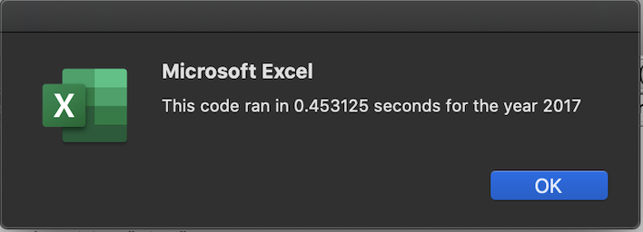
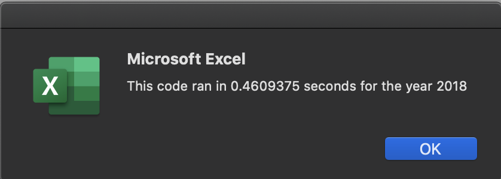

# Stock-Analysis

# **Analysis of Stock Tickers on Total Volume and Return on Investment**
---
## **Overview of Project:**

The purpose of this analysis is to provide Steve with the data needed to make an informed decision on which stocks will be the best investment option based on total volume and the total return. I ran the analysis based on 12 tickers in the dataset to create a visualization of which stock will offer the best return on Steve’s investment. 

## **Analysis:**

We had information for 12 different tickers, including the open and closing prices as well as the daily volume for both 2017 and 2018. 

I ran the VBA code to analyze the total daily volume and return for 12 different tickers for both years. I created an array of the 12 tickers I was analyzing and set up a nested loop to determine the starting price, ending price and total volume. This was done by initializing the variables to store the data for each ticker in the loop. I used the same variables to create the output array to show the Ticker, Total Daily Volume, and Return. I applied formatting to the output to highlight negative return as red and positive return as green, to provide a clear visualization into the stocks that offer the best return.

### Performance of Stocks in 2017 and 2018
Overall, most tickers’ return decreased significantly and dropped into the negative from 2017 to 2018. In 2017, all tickers except for TERP had a positive return. In 2018, only ENPH and RUN had positive returns, with RUN providing the best option for a return.

We ran the original code to analyze the 2017 and 2018 ticker data using for loops and nested for loops, with conditional formatting. The nested for loops allowed for the code to analyze and save the data for each ticker in the variables and then move on to the next ticker. This saves time from having to write the code and values for each ticker.

## **Refactoring Code:**

Refactoring code is beneficial as it provides a simpler, quicker option to run through all the code in one loop. This is beneficial as the data is run in one loop and is more efficient, easier to understand, and quicker to run. Essentially, we were able to reduce the amount of code written to run the same output, but quicker and less memory used. 

Refactoring code may also be disadvantageous. Times when this may be the case are when the code is working and refactoring it to make it simpler, but instead remove small parts to the code to make it run differently. Also, sometimes there are “short cuts” to code to make it quicker and easier to understand but are not the correct way of running the code.

### Execution Times
The original code took .453125 seconds time to run the code and provide the output in the selected worksheet. The refactored code, which used a mix of nested loops, took .453125 seconds to run the code for the 2017 analysis.

For 2018, the original code took .4609375 seconds to run and the refactored code took .4609375 seconds to run. 

The refactored code ran in the same amount of time but used less steps, so it was easier to understand for Steve or anyone else reading the code. 
